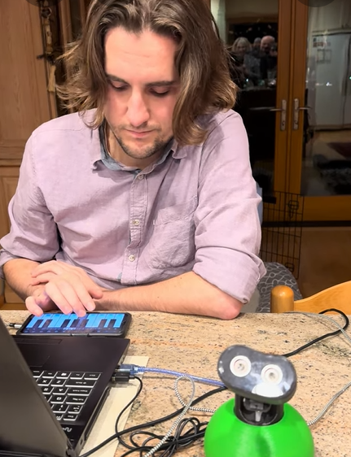

# buddy_singer
a repository to get a robot to sing from MIDI files. See a video demo [here](https://www.youtube.com/shorts/IcYGP01VqKk).

The firmware needs to be uploaded onto the arduino (using platformio, open the robo_sing sub folder as a project). Then you can play midi files by running `python -m pip install -r requirements.txt` and `python midi_parser.py` from the root of this repo.

Some helpful links on the midi file structure i used:
* https://majicdesigns.github.io/MD_MIDIFile/page_timing.html
* https://www.music.mcgill.ca/~ich/classes/mumt306/StandardMIDIfileformat.html
* https://mido.readthedocs.io/en/stable/files/midi.html#:~:text=Unlike%20music%2C%20tempo%20in%20MIDI,500000%20microseconds%20per%20quarter%20note.
